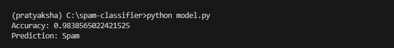
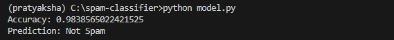

#  Spam Message Classifier

## Overview
This project is a Machine Learning-based Spam Message Classifier that predicts whether a given message is spam or not spam (ham).

# Objective
To build a model that can automatically detect spam messages using Natural Language Processing (NLP).

# Technologies Used
- Python
- Pandas
- Scikit-learn
- NLTK

# Dataset
The dataset used is the SMS Spam Collection dataset containing labeled messages as spam or ham.

# Methodology
1. Data preprocessing
2. Text vectorization using CountVectorizer
3. Model training using Multinomial Naive Bayes
4. Model evaluation using accuracy score

# Results
The model achieved an accuracy of approximately 98%.

## 🚀 How to Run
1. Install dependencies:
   pip install pandas scikit-learn nltk

2. Run the model:
   python model.py

# Example
Input: "You have won ₹5000!"
Output: Spam

Input: "Let's meet tomorrow"
Output: Not Spam

# Conclusion
The project successfully classifies spam messages with high accuracy and demonstrates the use of NLP in real-world applications.
## 📸 Output Examples

### Spam Example

### Not Spam Example

